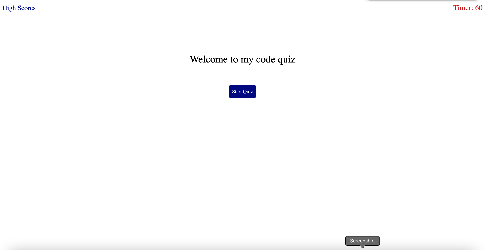
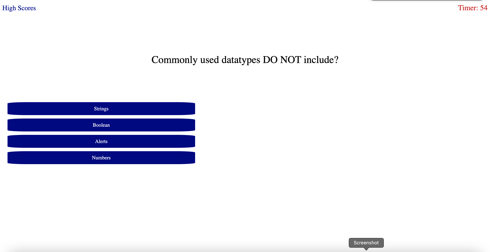
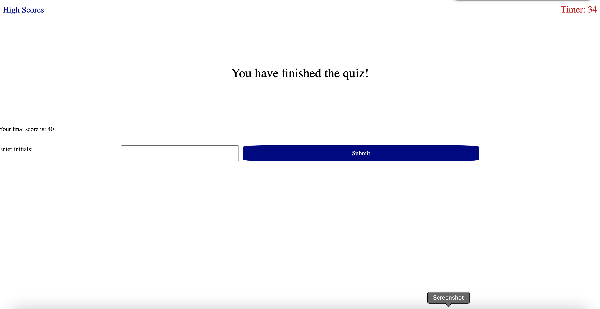

# Web Api Code Quiz
## Objectives
- When clicking  the start button
- A timer starts then user is presented with a question
- The question is answered
- The user is then presented with another question until all questions have been answered
- The user can then save initials and score when game is over.
## Final screenshots of initial and results page

## Links for Github Repository and final public page
<https://github.com/jayBassMan/Web-APIs-Code-Quiz>

<https://jaybassman.github.io/Web-APIs-Code-Quiz/>

## Contributions and Sources

- Phil Loy

## License
This code is licensed under the MIT License
